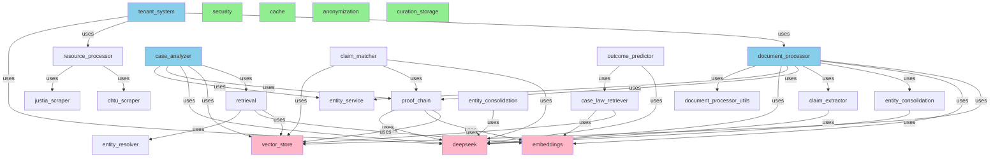

# Service Dependency Graph

## Mermaid Diagram (Most Critical Dependencies)



## Hierarchical View (Layers)

```
┌─────────────────────────────────────────────────────────────────┐
│ LAYER 0: ENTRY POINTS                                          │
│ ┌─────────────────────────────────────────────────────────────┐ │
│ │ • tenant_system.py                                          │ │
│ │   └─ Initializes and orchestrates entire system            │ │
│ └─────────────────────────────────────────────────────────────┘ │
└────────────────┬────────────────────────────────────────────────┘
                 │
     ┌───────────┼───────────┐
     │           │           │
     ▼           ▼           ▼
┌──────────┐ ┌──────────┐ ┌──────────┐
│document_ │ │resource_ │ │deepseek  │
│processor │ │processor │ │LLM client│
└────┬─────┘ └────┬─────┘ └──────────┘
     │            │
     ▼            ▼
┌────────────────────────────────────────────────────────────────┐
│ LAYER 1: ORCHESTRATORS & SCRAPERS                             │
│ ┌──────────┐ ┌──────────┐ ┌────────────┐ ┌──────────┐        │
│ │case_     │ │entity_   │ │proof_chain │ │claim_    │        │
│ │analyzer  │ │consolidat│ │_service    │ │matcher   │        │
│ │          │ │ion       │ │            │ │          │        │
│ └────┬─────┘ └──────────┘ └────┬───────┘ └──────────┘        │
│      │                         │                              │
│      └────────────┬────────────┘                              │
│                   │                                           │
│ ┌──────────┐ ┌──────────┐ ┌──────────┐ ┌──────────────┐    │
│ │retrieval │ │claim_    │ │outcome_  │ │case_law_    │    │
│ │          │ │extractor │ │predictor │ │retriever    │    │
│ └────┬─────┘ └──────────┘ └──────────┘ └────┬───────┘    │
│      │                                       │              │
│ ┌────────────────┐  ┌──────────────────┐   │              │
│ │chtu_scraper    │  │justia_scraper    │   │              │
│ └────────────────┘  └──────────────────┘   │              │
└────────────────────────────────────────────┼──────────────┘
                                             │
                                             ▼
┌────────────────────────────────────────────────────────────────┐
│ LAYER 2: CORE INFRASTRUCTURE                                  │
│ ┌───────────┐ ┌───────────┐ ┌─────────┐ ┌──────────┐        │
│ │vector_    │ │embeddings │ │entity_  │ │entity_   │        │
│ │store      │ │(sentence- │ │resolver │ │service   │        │
│ │(Qdrant)   │ │trans)     │ │(sim)    │ │(CRUD)    │        │
│ └───────────┘ └───────────┘ └─────────┘ └──────────┘        │
└────────────────────────────────────────────────────────────────┘
                        ▲
                        │
        ┌───────────────┼───────────────┐
        │               │               │
┌───────────────┐ ┌──────────┐ ┌──────────────┐
│security       │ │cache     │ │anonymization │
│(validation)   │ │(SQLite)  │ │(PII removal) │
└───────────────┘ └──────────┘ └──────────────┘
```

## Dependency Matrix

```
                    deepseek  vector  embeddings  proof_chain  entity_svc
case_analyzer         ✓         ✓        ✗           ✓            ✓
retrieval             ✗         ✓        ✓           ✗            ✗
document_processor    ✓         ✓        ✓           ✓            ✓
claim_matcher         ✓         ✓        ✗           ✓            ✗
outcome_predictor     ✓         ✗        ✗           ✗            ✗
proof_chain           ✓         ✓        ✓           ✗            ✗
case_law_retriever    ✗         ✓        ✓           ✗            ✗
entity_consolidation  ✓         ✗        ✗           ✗            ✗
claim_extractor       ✓         ✗        ✗           ✗            ✗
```

## Critical Path (Most Used)

```
User Request
    ↓
tenant_system (entry)
    ├─→ document_processor (10 deps) ← BOTTLENECK
    │   ├─→ deepseek (13 incoming) ← MOST CRITICAL
    │   ├─→ vector_store (7 incoming)
    │   ├─→ embeddings (4 incoming)
    │   ├─→ proof_chain (3 incoming)
    │   ├─→ entity_service (2 incoming)
    │   └─→ entity_consolidation
    │
    ├─→ resource_processor
    │   ├─→ chtu_scraper
    │   └─→ justia_scraper
    │
    └─→ case_analyzer
        ├─→ retrieval
        │   ├─→ vector_store
        │   ├─→ embeddings
        │   └─→ entity_resolver
        ├─→ proof_chain
        ├─→ entity_service
        └─→ deepseek
```

## Statistics

### Centrality (Most Important Services)

**By Incoming Connections (Criticality):**
1. **deepseek** - 13 services depend on it
2. **vector_store** - 7 services depend on it
3. **embeddings** - 4 services depend on it
4. **proof_chain** - 3 services depend on it
5. **entity_service** - 2 services depend on it

### By Outgoing Connections (Orchestration)

**Top Orchestrators:**
1. **document_processor** - depends on 10 services
2. **case_analyzer** - depends on 5 services
3. **claim_matcher** - depends on 3 services
4. **outcome_predictor** - depends on 2 services
5. **retrieval** - depends on 3 services

### Independence

**Leaf Services (No Dependencies):**
- deepseek, vector_store, embeddings, security, entity_resolver
- cache, curation_storage, anonymization, justia_scraper, chtu_scraper
- precedent_service, case_metadata_extractor

(These are infrastructure, utility, or external API clients)

### Isolation Risk

**Services Not Used by Others:**
- case_relevance_filter, case_metadata_extractor, precedent_service
- context_expander, legal_element_extractor, resource_processor
- chtu_scraper, justia_scraper, justia_search

(These may be deprecated, used only via routes, or future-proofing)

## Coupling Analysis

### Tight Coupling
- `document_processor` ← tightly coupled to 10 services (high risk if changed)
- `case_analyzer` ← depends on proof_chain + case_law_retriever + entity_service

### High Cohesion
- `retrieval` ecosystem: vector_store + embeddings + entity_resolver work together
- `proof_chain` ecosystem: deepseek + vector_store + embeddings work together

### Potential Decoupling Opportunities
1. **entity_consolidation** could be abstracted into a separate consolidation service
2. **claim_extractor** could be combined with **proof_chain** to reduce duplication
3. **case_law_retriever** could be abstracted into a "precedent service" pattern

## Circular Dependencies

✓ **None detected** - Dependency graph is acyclic (DAG structure is healthy)

## Performance Bottleneck Analysis

### Most Critical Service: **deepseek** (LLM Client)
- 13 incoming dependencies
- Every major analysis path calls this
- **Risk**: API rate limits, latency, cost
- **Mitigation**: Already has caching (cache.py) and async support

### Second Most Critical: **vector_store** (Qdrant)
- 7 incoming dependencies
- Used in all retrieval operations
- **Risk**: Vector DB connectivity, embedding quality
- **Mitigation**: Has fallback to BM25 search

### Third Most Critical: **embeddings** (Sentence Transformers)
- 4 incoming dependencies
- Used for vector encoding
- **Risk**: Model loading, GPU memory
- **Mitigation**: Cached model, batch processing

---

## How to Modify This Graph

1. **Adding a new service**:
   - Document imports in docstring
   - Update this file's dependency list

2. **Refactoring to reduce coupling**:
   - Consider breaking `document_processor` into smaller services
   - Create an abstract "ConsolidationService" interface

3. **Monitoring dependencies**:
   - Run analysis quarterly
   - Track incoming/outgoing connections per service
   - Alert if any service exceeds 8 dependencies

4. **Visualization updates**:
   - Use `pydeps` for automatic diagram generation: `pydeps tenant_legal_guidance --pylib --svg`
   - Use `pipdeptree` for pip dependency tree: `pipdeptree | grep -A5 tenant_legal_guidance`
